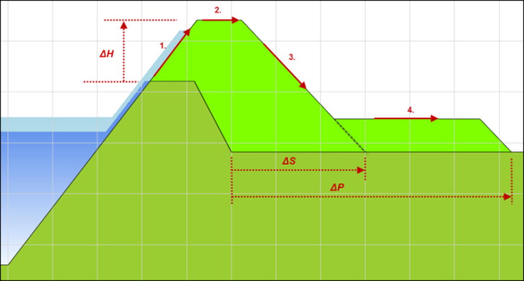
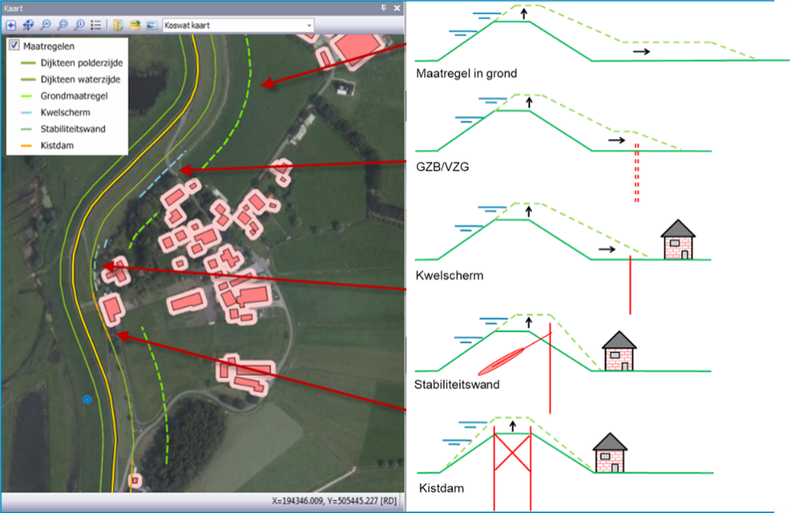

# De KOSWAT-methode

Ramingen in KOSWAT worden per dijksectie geheel bottom-up opgebouwd. Vanuit de versterkingsopgave ten aanzien van de faalmechanismen hoogte (ΔH), macrostabiliteit binnenwaarts (ΔS) en piping (ΔP) worden allereerst de dimensies van een dijkversterking in grond bepaald (zie [Figuur 1](#figuur-1)).

_Figuur 1 Ontwerpopgave dijkversterking KOSWAT in grond_

Daarnaast worden een aantal constructieve maatregelen[^1] uitgewerkt waarmee hetzelfde veiligheidsprobleem wordt opgelost, die vaak minder ruimte kosten maar wel veelal duurder zijn. Voor alle maatregelen, in grond en constructief, worden aan de hand van de benodigde hoeveelheden (klei, zand, staal, etc.) met behulp van eenheidsprijzen en opslagfactoren de eenheidskosten (€/m) bepaald volgens de SSK-systematiek; de Standaard Systematiek voor Kostenramingen in de GWW-sector. In de opslagfactoren die in de raming worden toegepast worden zaken als engineering, winst en risico, algemene kosten, vergunningen, e.d. aan de hand van percentages aan de ramingen toegevoegd.

Als laatste stap wordt bepaald welke maatregel (in grond of constructief) op welke plaats in de omgeving kan worden ingepast[^2]. Hierbij wordt geoptimaliseerd op basis van de eenheidskosten van de maatregelen om tot zo optimaal mogelijke totale versterkingskosten te komen. KOSWAT maakt hierbij gebruik van databases[^3] met gegevens over de omgeving van de dijk, waarin is vastgelegd op welke plek bijvoorbeeld bebouwing, spoorwegen en grote waterpartijen een grens stellen aan de beschikbare ruimte. Deze database bevat eveneens gegevens over weginfrastructuur die in geval van een versterking vervangen dient te worden. Op plaatsen waar (weg)infrastructuur direct achter de dijk ligt kunnen bepaalde constructieve maatregelen gekozen worden omdat deze goedkoper zijn dan het vervangen van de weg. Op een dijksectie wordt zodoende een mix van maatregelen gevonden waarbij vervolgens de totale kosten worden bepaald (zie [Figuur 2](#figuur-2)).

_Figuur 2 Voorbeeld KOSWAT mix van maatregel op een dijksectie_

Om voldoende vertrouwen in de raming te krijgen moet de basis van de raming (dus het ontwerp) zo goed mogelijk aansluiten bij de uitvoeringspraktijk, al moeten we ons realiseren dat KOSWAT de kosten behorend bij een mógelijke oplossing raamt, en niet per definitie bij dé oplossing die uiteindelijk ook in het veld aangelegd wordt. De raming van KOSWAT kan daarmee gezien worden als een budgetraming, het geeft een richting aan het bedrag dat nodig is om de betreffende dijk vanuit waterveiligheidsoogpunt[^4] te versterken.

De KOSWAT-kostendatabases (eenheidsprijzen en opslagfactoren) worden onderhouden en regelmatig van een update[^5] voorzien door Rijkswaterstaat Grote Projecten en Onderhoud (RWS GPO). Hierbij worden door GPO inzichten en gegevens uit een groot aantal referentieprojecten gebruikt.

[^1]: Beschouwde maatregelen zijn een kwelscherm of een (innovatieve) maatregel tegen piping (Verticaal Zanddicht Geotextiel (VZG) of een Grof-Zand-Barrière (GZB)), een (verankerde of onverankerde) stabiliteitswand, een diepwand of een kistdam.
[^2]: Uitgangspunt in de versterkingssystematiek is tot dusver dat KOSWAT zijn oplossingen in principe zoekt aan de binnendijkse zijde van de kering. In 2026 wordt dit uitgebreid naar de buitendijkse zijde.
[^3]: De database in KOSWAT is gebaseerd op de BAG, TOP10NL, het Nationaal WegenBestand, ProRail Spoorbaandelen, en andere bestanden en is met de release van KOSWAT geüpdatet eind 2025.
[^4]: Het toevoegen van ruimtelijke kwaliteit (fietspaden, recreatie, etc.) valt buiten de scope van KOSWAT.                                                                                                          
[^5]: Laatste update die heeft plaatsgevonden is prijspeil 2022, met een indexatie naar 2023.
