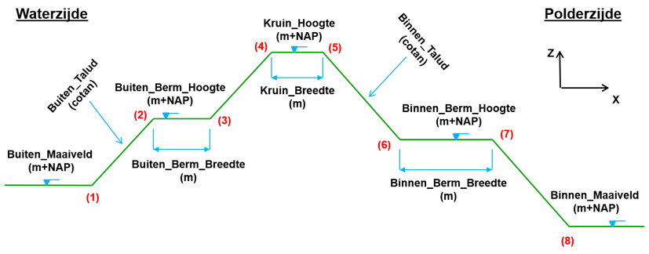

# Dijksectie invoer

De instelling [_[dijksectie_invoer]_](h04_projectdefinitie.md#analyse) in de project-json verwijst naar een map waarin de invoerbestanden per dijksectie zijn opgeslagen in afzonderlijke json-files. Deze json-files hebben een bestandsnaam die exact moet overeenkomen met de unieke dijksectienaam die is vastgelegd in de shapefile, dus {dijksectienaam}.json. De inhoud van de files hieronder beschreven.

```json
{
    "dijkprofiel": {
        "buiten_maaiveld": -0.4,
        "buiten_berm_lengte": 0.0,
        "buiten_berm_hoogte": -0.4,
        "buiten_talud": 2.32,
        "kruin_breedte": 4.71,
        "kruin_hoogte": 2.65,
        "binnen_talud": 2.0,
        "binnen_berm_lengte": 0.0,
        "binnen_berm_hoogte": -0.2,
        "binnen_maaiveld": -0.2,
        "grondaankoop_bebouwd": 176.62,
        "grondaankoop_onbebouwd": 9.22,
        "pleistoceen": -3.82,
        "aquifer": -2.57,
        "dikte_deklaag": 1.25
    },
    "grondmaatregel": { … },
    "verticalepipingoplossing": { … },
    "kwelscherm": { … },
    "stabiliteitswand": { … },
    "kistdam": { … },
    "infrastructuur": { … }
}
```

In de json wordt allereerst onder het kopje “dijkprofiel” de aanwezige dwarsdoorsnede gedefinieerd volgens onderstaande afbeelding, zie [Figuur 3](#figuur-3):

<a id="figuur-3"></a>



_Figuur 3 Definitie dwarsdoorsnede dijkprofiel_

Om de evt. benodigde (dam)wandlengtes[^10] te bepalen in constructieve versterkingen is ook de ligging van het pleistoceen en de bovenzijde van de watervoerende laag (_[aquifer]_) nodig.

Nb: De parameters _[factorzetting]_ en _[dikte_deklaag]_ worden nog niet gebruikt in de berekening, maar zijn op enkele plaatsen al te vinden in het voorbeeldproject. Met de eerste factor wordt later de extra benodigde volumes berekend die in een ophoging nodig zijn omdat de ondergrond zich nog gaat zetten, de tweede parameter komt in de plaats van de aquifer.

Naast de instellingen met betrekking tot het dijkprofiel is het in deze invoerbestanden mogelijk om rekeninstellingen per dijksectie op te geven waarmee specifiek voor deze dijksectie afgeweken wordt van de default project instellingen zoals gedefinieerd in het algemene project-json voor de grondmaatregel en de diverse constructieve maatregelen. Wanneer deze rekeninstellingen niet worden opgegeven wordt dus uitgegaan van de default. Zo kan bijvoorbeeld opgegeven worden om op deze dijksectie nooit voor een stabiliteitswand te kiezen (“actief”: false), of te rekenen met andere laagdiktes of andere specifieke instellingen. 

Let op: instellingen m.b.t. de toe te passen omgevingsdatabases kunnen (nog?) niet per dijksectie gevarieerd worden!

[^10]: De gebruikte rekenroutines bij het bepalen van de wandlengtes gaan in 2026 op de schop.
