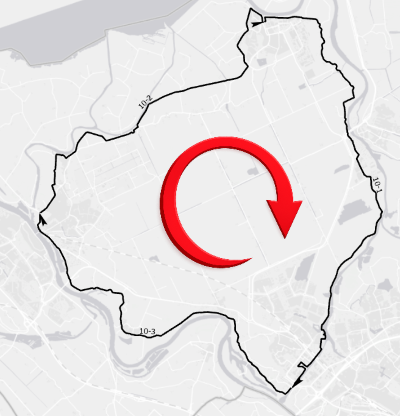
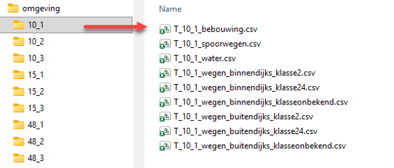
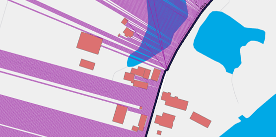

# Omgevingsdatabases

KOSWAT gebruikt in z’n analyses een aantal omgevingsdatabases om de ligging van obstructies en infrastructuur in de invloedzone van de versterking te beschrijven, om aan de hand daarvan keuzes voor de versterkingsmaatregelen te kunnen maken in de beschikbare ruimte. Het maken van deze omgevingsanalyses is bewerkelijk, en zou in iedere KOSWAT berekening veel rekentijd vragen om dat on-the-fly te doen, vandaar dat ervoor is gekozen om deze databases voor bebouwing, spoorwegen en waterpartijen op voorhand op te stellen voor alle normtrajecten in Nederland.

Bij het opstellen van databases is uitgegaan van de ligging van de dijktrajecten volgens het Nationaal Basisbestand Primaire Waterkeringen NBPW[^11]. Om de databases op te kunnen stellen zijn hierop een aantal bewerkingen uitgevoerd. Zo moeten trajecten bestaan uit zgn. single-line strings (ofwel ononderbroken lijnstukken), trajecten die uit meerdere afzonderlijke delen bestaan worden opgesplitst en krijgen een subtrajectcode eindigend op -A, -B, -C etc. Voor KOSWAT zijn enkel categorie A keringen van belang (dijkringen, geen verbindende keringen). Belangrijkste is dat ieder lijnsegment de juiste <u>richting</u> moet hebben, namelijk ten opzichte van het beschermde gebied met de klok mee. Op deze manier is rechts van de lijn altijd de binnendijkse kant, links is altijd buitendijks.

<a id="figuur-7"></a>



_Richting van lijnelementen in NBPW_


Vooralsnog zijn voor ieder dijktraject omgevingsdatabases met obstructies opgesteld voor bebouwing, spoorwegen en water in de versterkingszone. In de project-json wordt verwezen naar de locatie van de databases op de schijf. Binnen deze map zijn submappen voor ieder dijktraject te vinden, bestanden aldaar moeten voldoen aan de naamgeving zoals weergegeven in [Figuur 4](#figuur-4). Wanneer bijvoorbeeld een extra omgevingstype _“natura2000”_ wordt toegevoegd in de analyses (zie de [rekeninstelling mbt de omgeving](h04_projectdefinitie.md)) dient in deze map een bestand geplaatst te worden met de naam _“T_10_1_natura2000.csv”_.

<a id="figuur-4"></a>



_Figuur 4 Folderstructuur omgevingsdatabases_

Voor het produceren van omgevingsdatabases zijn scripts in Python beschikbaar, waarmee databases gemaakt kunnen worden op basis van de ligging van de keringen in het (bewerkte) NBPW en polygonen met obstructies in de versterkingszone. In het script worden allereerst op iedere meter punten gezet op de dijklijn, vervolgens wordt aan binnen- en buitendijkse zijde loodrecht op de dijklijn gekeken (in een zone van 500 meter) óf en zo ja, op welke afstand hier een obstructie wordt gevonden, zoals weergeven in [Figuur 5](#figuur-5).

<a id="figuur-5"></a>



_Visualisatie omgevingsdatabases bebouwing_

Omgevingsdatabases krijgen het volgende format, met per punt het x-y coördinaat, de afstand tot een object aan binnen- en buitendijkse zijde, en de zoekrichting aan binnen- en buitendijkse zijde in graden (positieve x-as = 0 graden, tegen de klok in). De A in de eerste kolom staat voor het subtraject, bij een overgang van subtraject A naar B zit een ‘gat’ in het normtraject.

```text
Sectie;Xcoord;Ycoord;dist_binnen;dist_buiten;angle_binnen;angle_buiten
A;199186.66;515698.01;340;500;-76.0;104.0
A;199187.63;515698.25;340;500;-76.0;104.0
A;199188.6;515698.49;340;500;-76.0;104.0
A;199189.57;515698.74;340;500;-76.0;104.0
A;199190.54;515698.98;339;500;-76.0;104.0
A;199191.51;515699.22;339;500;-76.0;104.0
A;199192.48;515699.46;339;500;-76.0;104.0
A;199193.45;515699.7;339;500;-76.0;104.0
A;199194.42;515699.95;339;500;-76.0;104.0
A;199195.39;515700.19;339;500;-76.0;104.0
A;199196.36;515700.43;339;500;-76.0;104.0
etc
```

Voor weginfrastructuur zijn eveneens databases beschikbaar, waarvoor eveneens een Python script is ontwikkeld om de databases op te stellen. De databases zijn ingedeeld naar wegklasse (<2m, 2-4m, 4-7m, >7m en onbekend)[^12]. Hierbij is echter niet enkel de minimale afstand tot een weg relevant, maar willen we voor iedere zone naast de dijk weten hoeveel er van die weg ligt. Databases krijgen hiermee een iets afwijkend format, met in de kolommen in iedere zone het aantal strekkende meters van de betreffende weg. Ieder wegsegment wordt hierbij slechts eenmaal (aan het dichtstbijzijnde) meter-punt toebedeeld, dit is relevant wanneer er bijvoorbeeld bochten in het dijktraject zitten. De breedte van de zones is vastgelegd middels de header van het bestand, in dit geval is gewerkt in stappen van 5 meter, dit had echter ook 1 meter kunnen zijn (levert grotere bestanden). De inventarisatie loopt veelal tot 200 meter binnen- en buitendijks.

```text
Sectie;Xcoord;Ycoord;afst_5m;afst_10m;afst_15m;afst_20m;afst_25m;etc
A;199202.19;515701.88;0;0;0;0;0;0;0;0;0;0;0;0;0;0;0;0;0;0;0;0;0;etc
A;199203.16;515702.12;0;0;0;0;0;0;0;0;0;0;0;0;0;0;0;0;0;0;0;0;0;etc
A;199204.13;515702.37;0;0;0;0;0;0;0;0;0;0;0;0;0;0;0;0;0;0;0;0;0;etc
A;199205.10;515702.61;0;0;0;0;0;0;0;0;0;0;0;0;0;0;0;0;0;0;0;0;0;etc
A;199206.07;515702.85;0;0;0;0;0;0;0;0;0;0;0;0;0;0;0;0;0;0;0;0;0;etc
A;199207.04;515703.09;0;0;0;0;0;0;0;0;0;0;0;0;0;0;0;0;0;0;0;0;0;etc
A;199208.01;515703.33;0;0;0;0;0;0;0;0;0;0;0;0;0;0;0;0;0;0;0;0;0;etc
A;199208.98;515703.57;0;0;0;0;0;0;0;0;0;0;0;0;0;0;0;0;0;0;0;0;0;etc
A;199209.95;515703.82;0;0;0;0;0;0;0;0;0;0;0;0;0;0;0;0;0;0;0;4;5;etc
A;199210.92;515704.06;2;5;5;5;5;5;5;5;5;5;5;5;5;5;5;5;5;5;5;3;0;etc
A;199211.63;515704.45;4;0;0;0;0;0;0;0;0;0;0;0;0;0;0;0;0;0;0;0;0;etc
A;199211.36;515705.41;1;0;0;0;0;0;0;0;0;0;0;0;0;0;0;0;0;0;0;0;0;etc
A;199211.09;515706.38;1;0;0;0;0;0;0;0;0;0;0;0;0;0;0;0;0;0;0;0;0;etc
A;199210.82;515707.34;1;0;0;0;0;0;0;0;0;0;0;0;0;0;0;0;0;0;0;0;0;etc
A;199210.56;515708.30;1;0;0;0;0;0;0;0;0;0;0;0;0;0;0;0;0;0;0;0;0;etc
etc
```

[^11]: Bij de eerste oplevering van KOSWAT is uitgegaan van de shapefile NBPW gedownload via Waterveiligheidsportaal / Nationaal Georegister dd. 3 maart 2025.
[^12]: Deze klasseindeling sluit niet meer aan op het Nationaal Wegen Bestand en wordt in 2026 heroverwogen.
