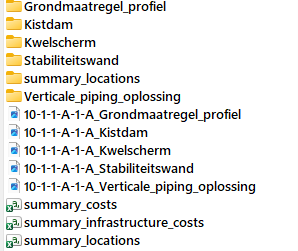
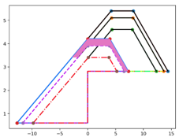
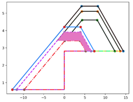
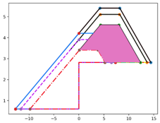
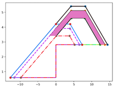
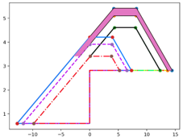
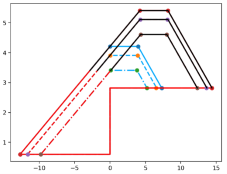

# KOSWAT uitvoer

Wanneer een KOSWAT project wordt doorgerekend, worden de uitvoerfiles weggeschreven in de map die opgegeven is door de gebruiker in de project-json in de instelling [Uitvoerfolder](h04_projectdefinitie.md#analyse). Iedere combinatie van dijksectie en versterkingsscenario wordt hierbij apart doorgerekend en weggeschreven in de subfolder "_dike\_{dijksectie_naam}\scenario\_{scenario_naam}_".

In deze mappen zitten de volgende bestanden:

## Totaaloverzicht

In de tabel _“summary_costs.csv”_ wordt de totale gemaakte kostenraming gerapporteerd. In de kolommen zijn daarbij de gegevens voor de verschillende versterkingsmaatregelen te zien.

Bovenin het bestand wordt gestart met de _“Strategy reinforcement order”_, de volgorde waarin de maatregelen gekozen zullen worden voor zover de ruimte rond de dijk beschikbaar is, oplopend vanaf 0 (dus 0,1,2, etc). Deze volgorde wordt bepaald op basis van de kosten per km van het beschouwde maatregeltype (goedkoper heeft de voorkeur) in combinatie met het ruimtebeslag van de maatregel. Wanneer een versterkingsmaatregel duurder is én meer (of evenveel) ruimte kost dan een andere mogelijke maatregel op die plek, dan zal deze in principe nooit gekozen worden. In de _“Strategy reinforcement order”_ komt dan -1 te staan.

Vervolgens volgen een flink aantal rijen met berekende hoeveelheden (_“quantity”_), directe bouwkosten (“_cost_”) en kosten inclusief opslagfactoren (“_cost incl surtax_”). Bovenin wordt allereerst de eenheidsprijs (€/km) voor de verschillende maatregeltypen gerapporteerd, de directe bouwkosten en de kosten inclusief opslagfactoren. Deze worden in de rijen daaronder uitgesplitst in verschillende kostencomponenten, met de hoeveelheden daarbij, aansluitend bij de versterkingssystematiek die is geschetst in [Grondwerk](h10_sskmethodiek.md#grondwerk).

Onderin het bestand wordt uiteindelijk gerapporteerd over welke lengte van de dijksectie (_“Total measure meters”_) iedere maatregel gekozen wordt, zie hiervoor ook [Ruimtelijk beeld](#ruimtelijkbeeld). Daarbij staan ook de totale versterkingskosten die hiermee voor ieder maatregeltype gevonden worden (de eenheidskosten €/m vermenigvuldigd met de lengte m waarover de maatregel wordt toegepast) in de “_Total measure cost_”. Vervolgens worden hierbij de kosten die samenhangen met het vervangen van infrastructuur gevoegd (_“Infrastructure cost”, zie [Infrastructuur kosten](#infrastructuurkosten)), en worden de totale resulterende kosten (_“Total cost”_) per maatregeltype berekend.

In de laatste kolom worden de totaalkosten voor de afzonderlijke maatregeltypen nog bij elkaar opgeteld tot de totaalkosten voor de dijksectie.

## Ruimtelijk beeld

In de tabel _“summary_locations.csv”_ wordt de ruimtelijke analyse die is gemaakt samengevat per strekkende meter dijk. Op basis van de meterpunten die ontleend zijn aan de omgevingsdatabases (zie [Omgevingsdatabases](h08_omgevingsdatabases.md)), wordt per maatregeltype (kolommen) weergegeven of deze maatregel ingepast zou kunnen worden (1) of niet (0).

Op basis van deze analyse in combinatie met de _“Strategy reinforcement order”_ (zie [Totaaloverzicht](#totaaloverzicht)) wordt een eerste selectie (kolom _“Initial selection”_) van toe te passen maatregelen gemaakt. Vervolgens wordt aan de hand van de rekeninstellingen met betrekking tot overgangsconstructies en de minimale ruimte tussen constructieve strekkingen (zie [Omgeving](h04_projectdefinitie.md#omgeving)) een eerste basis neergezet voor de kostenraming (kolom _“Ordered selection”_). Tenslotte wordt nog geoptimaliseerd op basis van aanwezige infrastructuur in de versterkingszone. Hierbij kan het voorkomen dat op een duurder maatregeltype wordt overgestapt die minder ruimte kost omdat kosten van infrastructuur achter de kering dan lager uitvallen (kolom _“Optimized selection”_).

Het ruimtelijk beeld wordt ook weggeschreven als shapefiles in de map _“summary_locations”_. In deze map zijn shapefiles te vinden met:

- de ligging van de binnendijkteen van het oude profiel (_“summary_locations_old.shp”_)
- de binnendijkteen van de versterkte dijk (_“summary_locations_new.shp”_)
- de uiteindelijk gekozen maatregeltypen uit de optimized selection (_“summary_locations_measures.shp”_)
- de maatregeltypen uit de tussenstap “Ordered selection” (_“summary_locations_step.shp”_)

## Infrastructuur kosten

De tabel _“summary_infrastructure_costs.csv”_ is erg uitgebreid en geeft inzicht in de opbouw van de berekende infrastructuurkosten.

In de basis wordt (vanaf kolom K) per strekkende meter dijksectie voor ieder maatregeltype (grondmaatregel, kwelscherm, stabiliteitswand, etc) en voor iedere klasse weginfrastructuur (<2m, 2-4m, 4-7m, >7m en klasse onbekend) het aantal vierkante meters wegdek in de versterkingszone gerapporteerd met de bijbehorende (directe) kosten. Daarbij wordt nog onderscheid gemaakt in infrastructuur op de kruin van de dijk (zone A) en infrastructuur daarbuiten (zone B). Dit omdat met deze verschillende zones in de kostenberekening anders omgegaan wordt, zie [Infrastructuur](h04_projectdefinitie.md#infrastructuur).

In kolommen F t/m J worden per maatregeltype de kosten over de verschillende infrastructuurklasse bij elkaar opgeteld. In Kolom D wordt de uiteindelijk gekozen maatregel weergegeven (zie [Ruimtelijk beeld](#ruimtelijkbeeld)) met in kolom E de bijbehorende uiteindelijke infrastructuurkosten. Deze komt overeen met de totale infrastructuurkosten in de tabel _“summary_costs.csv”_.

## Afbeeldingen en mappen per versterkingsmaatregel

De afbeeldingen (*.png) in deze map laten de geschematiseerde dwarsdoorsnede van alle verschillende versterkingsmaatregelen zien, met de verschillende lagen waaruit de dijk is opgebouwd. In de bijbehorende mappen zitten daarnaast meer afbeeldingen met daarin de verschillende lagen gearceerd op basis waarvan de volumeberekeningen zijn uitgevoerd. Dit sluit aan bij de versterkingssystematiek die is geschetst in [Grondwerk](h10_sskmethodiek.md#grondwerk). De uitgevoerde afbeeldingen dienen allemaal ter visuele controle van de doorgerekende maatregelen.

| _Stap 1. Verwijderen oude grasbekleding_ | _Stap 2. Verwijderen oude kleilaag_ |
| --- | --- |
|  |  |
| **_Stap 3. Aanvullen kernmateriaal_** | **_Stap 4. Aanleg nieuwe kleilaag_** |
|  |  |
| **_Stap 5. Aanleg nieuwe grasbekleding_** | **_Versterkingsmaatregel overzicht_** |
|  |  |
