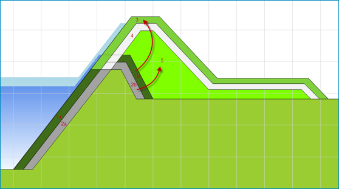

# Kostenberekening volgens de Standaardsystematiek Kostenramingen in de GWW-sector (SSK)

## SSK-systematiek
<a id="ssk"></a>
KOSWAT maakt voor z’n kostenramingen gebruik van de Standaard Systematiek voor Kostenramingen in de Grond-, Weg-, en Waterbouw (SSK-systematiek). Investeringskosten worden in deze systematiek berekend door de kostencategorieën Bouwkosten, Vastgoedkosten, Engineeringskosten (samen de Basisraming genoemd) en Overige Bijkomende Kosten bij elkaar op te tellen, en daarop een toeslag te zetten voor de Objectoverstijgende risico’s en eventueel BTW. De verschillende kostencategorieën bestaan ieder uit de Benoemde Directe Kosten, Nader Te Detailleren Directe Kosten en Indirecte Kosten.

Binnen KOSWAT worden voor de kostencategorieën Bouwkosten en Vastgoedkosten volledig bottom-up de Benoemde Directe Kosten bepaald door berekende hoeveelheden uit het ontwerp te vermenigvuldigen met eenheidsprijzen (of kostenkengetallen). We maken hierbij onderscheid naar Benoemde Directe Bouwkosten (BDBK) van de maatregelen en Benoemde Directe Vastgoedkosten (BDVK) voor de aankoop van grond.

Alle overige kostenposten worden bepaald door het toepassen van opslagfactoren, waarbij de diverse posten als percentage van de Benoemde Directe Kosten worden gespecificeerd. De in KOSWAT gehanteerde eenheidsprijzen en opslagfactoren worden ontleend aan het KOSWAT Eenheidsprijzenbestand dat wordt onderhouden door RWS GPO. Een gebruiker kan kiezen om hiervan af te wijken.

Om tot een raming van de Investeringskosten te komen dienen deze Benoemde Directe Kosten vermenigvuldigd te worden met opslagfactoren. Binnen KOSWAT wordt een aantal verschillende opslagfactoren gebruikt, afhankelijk van het type maatregel, in grond of constructief. Daarnaast wordt in de opslagfactoren nog onderscheid gemaakt naar de moeilijkheidsgraad van het werk.

Zo kan bij het grondwerk bij een maatregel in grond met een lagere opslagfactor gewerkt worden dan bij het grondwerk van bijvoorbeeld een kistdam. In de opslagfactoren zit ook een percentage voor BTW versleuteld. In de rekeninstellingen kan een gebruiker aangeven of in- of exclusief BTW gerekend moet worden. Daarbij worden dus andere opslagfactoren gehanteerd.

Hieronder volgt een lijst met de verschillende componenten waaruit de totale investeringskosten in KOSWAT bestaan. Tussen haakjes is de moeilijkheidsklasse van de opslagfactor gegeven die in KOSWAT per default wordt gebruikt. Dit is aan te passen door de gebruiker in de rekeninstellingen.

**Maatregel in grond:**<br>
Grondwerk: BDBK x Opslag Grondwerk (Normaal)<br>
Grondaankoop: BDVK x Opslag Grondaankoop (Normaal)

**Kwelscherm en VZG:**<br>
Grondwerk: BDBK x Opslag Grondwerk (Normaal)<br>
Constructieve elementen: BDBK x Opslag Constructie (Normaal)<br>
Grondaankoop: BDVK x Opslag Grondaankoop (Normaal)

**Stabiliteitswand:**<br>
Grondwerk: BDBK x Opslag Grondwerk (Moeilijk)<br>
Constructieve elementen: BDBK x Opslag Constructie (Normaal)<br>
Grondaankoop: BDVK x Opslag Grondaankoop (Moeilijk)

**Kistdam:**<br>
Grondwerk: BDBK x Opslag Grondwerk (Moeilijk)<br>
Constructieve elementen: BDBK x Opslag Constructie (Moeilijk)

**Weginfrastructuur:**<br>
BDBK Infrastructuur x Opslag Infrastructuur (Normaal)

De opslagfactoren (inclusief en exclusief btw) worden gespecificeerd in het eenheidsprijzenbestand zoals beschreven in [Eenheidsprijzen](h04_projectdefinitie.md#eenheidsprijzen). Dit zijn defaultwaarden zoals aangeleverd door RWS-GPO. In een toekomstige versie worden de opslagfactoren nader uitgesplitst in hun componenten (bijvoorbeeld engineering, winst&risico), zodat ramingen transparanter worden.

```json
"kostenopslagfactoreninclbtw": {
    "grond_makkelijk": 2.258,
    "grond_normaal": 2.509,
    "grond_moeilijk": 2.777,
    "constructief_makkelijk": 2.561,
    "constructief_normaal": 2.912,
    "constructief_moeilijk": 3.295,
    "wegen_makkelijk": 2.561,
    "wegen_normaal": 2.912,
    "wegen_moeilijk": 3.295,
    "grondaankoop_makkelijk": 1.292,
    "grondaankoop_normaal": 1.412,
    "grondaankoop_moeilijk": 1.645
},
"kostenopslagfactorenexclbtw": {
    "grond_makkelijk": 1.89,
    "grond_normaal": 2.105,
    "grond_moeilijk": 2.335,
    "constructief_makkelijk": 2.143,
    "constructief_normaal": 2.443,
    "constructief_moeilijk": 2.77,
    "wegen_makkelijk": 2.143,
    "wegen_normaal": 2.443,
    "wegen_moeilijk": 2.77,
    "grondaankoop_makkelijk": 1.292,
    "grondaankoop_normaal": 1.412,
    "grondaankoop_moeilijk": 1.645
}
```

KOSWAT berekent enkel investeringskosten. Het bepalen van bijvoorbeeld investeringsstrategieën, Life Cycle Costing (LCC) en kosten voor beheer en onderhoud maken geen onderdeel uit van KOSWAT.

## Grondwerk
<a id="grondwerk"></a>
Om in KOSWAT een berekening van de Benoemde Directe Bouwkosten (BDBK) van het grondwerk te kunnen maken orden hoeveelheden vermenigvuldigd met eenheidsprijzen. Deze paragraaf beschrijft welke hoeveelheden er aan de orde zijn in het geval van een versterking in grond. Het gaat hier om eenheidskosten per strekkende meter dijkversterking.

In KOSWAT wordt ervan uit gegaan dat een dijk uit drie afzonderlijke lagen bestaat. Het profiel is afgewerkt met een bekledingslaag van gras met daaronder een waterdichte kleilaag. De resterende kern van de dijk is opgebouwd uit een zandlichaam. In principe worden de hoeveelheden gevonden door het huidige aanwezige profiel af te trekken van het nieuw ontworpen profiel. Echter, in de versterking wordt verschillend met de diverse lagen omgegaan.

De volgende stappen worden gevolgd, zie de nummering in [Figuur 6](#figuur-6):

- De grasbekleding van het huidig profiel wordt gedeeltelijk verwijderd (deel 1b), en opzij gelegd om opnieuw te kunnen gebruiken als bekledingslaag in het nieuwe profiel (3)
- De kleilaag van het huidig profiel wordt gedeeltelijk verwijderd (2b), en gebruikt als kernmateriaal in het nieuwe profiel (5)
- Kernmateriaal van de nieuwe dijk wordt aangevuld en geprofileerd (5)
- Kleilaag wordt aangebracht op de nieuwe kern (4)
- De grasbekleding wordt aangebracht op de nieuwe afdeklaag

<a id="figuur-6"></a>



_Figuur 6 Volumeberekeningen van grondwerk_

De volgende hoeveelheden worden in de berekening bepaald. Deze dienen als input voor de kostenberekening van het grondwerk.

- Hoeveelheid aanvoeren en verwerken teelaarde (toplaag)
- Hoeveelheid aanvoeren en verwerken klei (afdeklaag)
- Hoeveelheid aanvoeren en verwerken kernmateriaal (zand)
- Hoeveelheid als toplaag in profiel te verwerken
- Hoeveelheid als kernmateriaal in profiel te verwerken
- Hoeveelheid af te voeren overtollig materiaal
- Oppervlakte profiel voor profilering + inzaaien
- Oppervlakte afdeklaag voor profilering
- Oppervlakte kernlaag (zandlichaam) voor profilering
- Oppervlakte grondgebruik nieuw profiel voor bewerking maaiveld

De hoeveelheden die zijn bepaald worden volgens de SSK-systematiek vermenigvuldigd met eenheidsprijzen om tot Benoemde Directe Bouwkosten (BDBK) per strekkende meter dijksectie te komen. De eenheidsprijzen worden gedefinieerd in het betreffende invoerbestand (*.json), zie onderstaand. De BDBK worden uiteindelijk vermenigvuldigd met een opslagfactor om tot totale investeringskosten te komen zoals beschreven in [Kostenberekening volgens SSK](#ssk).

```json
"kostendijkprofiel": {
    "aanleg_graslaag_m3": 16.12,
    "aanleg_kleilaag_m3": 20.09,
    "aanleg_kern_m3": 13.87,
    "hergebruik_graslaag_m3": 7.28,
    "hergebruik_kern_m3": 5.69,
    "afvoeren_materiaal_m3": 9.02,
    "profileren_graslaag_m2": 1.06,
    "profileren_kleilaag_m2": 0.76,
    "profileren_kern_m2": 0.7,
    "bewerken_maaiveld_m2": 0.29
}
```

## Constructieve oplossingen
<a id="constructief"></a>
Op plaatsen waar geen ruimte is voor een dijkversterkingsmaatregel in grond, kiest KOSWAT voor de goedkoopste constructieve oplossing die wel in de beschikbare ruimte past. Op plekken waar bebouwing in het bestaande dijklichaam zit, kiest KOSWAT vooralsnog voor een kistdam. Deze afwegingssystematiek wordt in 2026 aangepast, alsmede de berekende dimensies van damwanden e.d.

KOSWAT heeft de beschikking over verschillende constructieve maatregelen die altijd een combinatie zijn van de aanpassing van het dijkprofiel in grond, met daarbij de toevoeging van een constructief element. Voor bepalen van de BDBK van het grondwerk wordt dezelfde systematiek toegepast als voor een versterking in grond, zie [Grondwerk](#grondwerk). Wel worden hierbij andere opslagfactoren gehanteerd, samenhangend met de moeilijkheidsgraad van het werk (constructieve oplossingen vinden per definitie plaats in gebieden met minder ruimte, dus zijn lastiger uit te voeren).

Voor de BDBK van het constructieve deel (de wand zelf) worden (samengestelde) eenheidskostencurves gebruikt. Achter elke constructieve maatregel zit een gefitte kostencurve die afhankelijk is van de wandlengte van de constructie. Ze zijn bepaald door bij een aantal discrete wandlengtes de kosten te bepalen, en hierdoor vervolgens de curves te fitten. Zo is er een curve voor een cement-bentonietwand, een damwand, een diepwand, etc. Deze curves zijn onderbouwd door RWS-GPO, en bevatten naast de materiaalkosten ook de kosten van uitvoering. De wiskundige beschrijving van de samengestelde eenheidskostenfunctie is als volgt:

```text
f(x) = cx² + dx + z + fxᵍ
```

waarbij x de wandlengte is, en c, d, f, g en z een serie constanten. Voor verschillende constructies (kistdam, damwand) spelen verschillende factoren een rol, waardoor sommige van de factoren op nul staan. De factoren van de constructieve elementen worden gedefinieerd in het betreffende invoerbestand (*.json), zie onderstaand.

```json
"kostenverticaalzanddichtgeotextiel": { "c": 0, "d": 0, "z": 676.91, "f": 0, "g": 0 },
"kostencbwand": { "c": 0, "d": 174.68, "z": -38.15, "f": 0, "g": 0 },
"kostendamwandonverankerd": { "c": 10.19, "d": 144.98, "z": 113.61, "f": 0, "g": 0 },
"kostendamwandverankerd": { "c": 10.19, "d": 164.94, "z": 1430.12, "f": 0, "g": 0 },
"kostendiepwand": { "c": 0, "d": 0, "z": 0, "f": 308.26, "g": 1.205 },
"kostenkistdam": { "c": 0, "d": 746.37, "z": -81.79, "f": 0, "g": 0 },
```

# Infrastructuur
<a id="infrastructuur"></a>
Infrastructuur in de versterkingszone stelt in principe geen grens aan de beschikbare ruimte, maar wordt vervangen (verwijderd en opnieuw aangebracht) of hersteld (enkel kosten van opnieuw aanleggen worden gerekend). De gehanteerde eenheidsprijzen zijn als volgt:

```json
"kosteninfrastructuur": {
    "wegen_klasse2_verwijderen": 10.34,
    "wegen_klasse24_verwijderen": 14.31,
    "wegen_klasse47_verwijderen": 26.63,
    "wegen_klasse7_verwijderen": 42.88,
    "wegen_onbekend_verwijderen": 14.31,
    "wegen_klasse2_aanleg": 36.83,
    "wegen_klasse24_aanleg": 52.26,
    "wegen_klasse47_aanleg": 52.24,
    "wegen_klasse7_aanleg": 60.61,
    "wegen_onbekend_aanleg": 52.26
}
```
