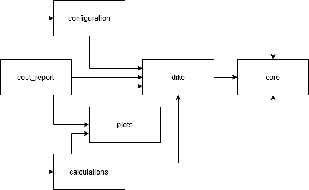

# Koswat architecture design

In general, the architecture of this package is based on the following principles:
- Single responsibility principle, [component hierarchy](#component-hierarchy).
- Open-closed principle, [inheritance](#inheritance).
- Interface segregation principle, [protocols](#protocols).

## Component-module hierarchy

We cluster entities into modules (components) that represent their domain and have minimal dependencies with others components, this way the modules can be accessed when operating Koswat as a sandbox. Within each component we apply the same principle and create sub-modules to reduce dependencies.

At the current version (v.0.12.1) the component hierarchy looks like follows:

    koswat/
        calculations/   # Dike calculations to generate possible reinforcements.
            io/
            outside_slope_reinforcement/
            protocols/
            standard_reinforcement/

        configuration/  # Data structures required for a koswat run.
            io/
            settings/

        core/           # Generic definitions and functionatilities.
            geometries/
            io/
            protocols/

        cost_report/    # Summary of costs per dike reinforcement.
            io/
            multi_location_profile/
            profile/
            summary/

        dike/           # Definition of a koswat dike.
            characteristic_points/
            layers/
            material/
            profile/
            surroundings/

        plots/          # Generic functionality for plotting.
            dike/
            geometries/

And the components interdependencies could be slightly represented as in the following diagram:

||
|:--:|
|Image 1. Component diagram|

## Inheritance

To facilitate the `Open-Closed principle` most of our classes have parameterless constructors (`__init__` method). Then, to instantiate objects we often relay on the implementation of [builder patterns](#builder-pattern)

## Protocols

In Koswat we make use of [Protocols](https://docs.python.org/3/library/typing.html?highlight=protocol#typing.Protocol) to define the __required__ and __essential__ properties and methods that represent an entity. Although Python does not always enforce these types as other OO languages would do (for instance C#), we try to follow and respect this principle throughought the whole repository.

### Builder pattern

Check for instance this [wikipedia article](https://en.wikipedia.org/wiki/Builder_pattern) for a more detailed reference.

Because most of our classes have dependencies on other classes their initialization would require multiple steps that would become tedious and hard to maintain if they were defined in the default __init__ method. Moreover, this approach would violate the open-closed principle. 

Therefore, we apply the builder pattern to reduce complexity at the classes, improving maintainability and enabling future developments to create a separate builder shall the design require a different way of instantiating a given class.