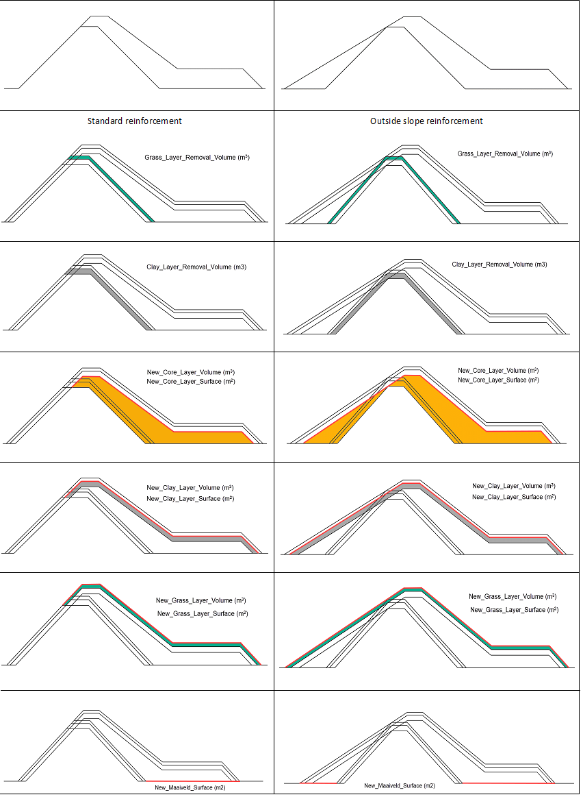
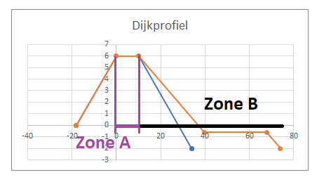
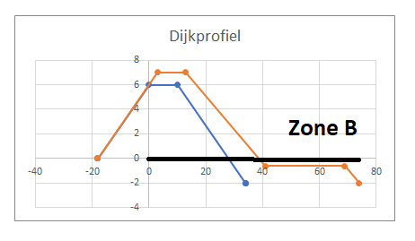

# Cost report

A Koswat report is divided in different parts:

- __Summary report__: A summary containing all 'location reports'.
- __Location report__: Which profile reinforcements can be applied to each location based on their surroundings and reinforcement properties (`MultiLocationProfileCostReport`). 
- [__Infrastructure report__](#infrastructure-report): (`InfrastructureLocationProfileCostReport`) Costs related to applying all calculated reinforcement profiles at the locations where infrastructures are present.
- __Profile report__: (`ProfileCostReport`), what are the (material) volume costs associated when applying a given [reinforced profile](./koswat_reinforced_profile.md#possible-reinforcements) .
- __Layer report__: A sub report of the 'profile report' which breaks down the different costs of each one of the layers. This can be seen in _Image 1 Volume costs_.

||
|:--:|
|Image 1. Volume costs|

## Infrastructure report

When determining the costs of infrastructures we look mainly at:

- The reinforcement profile (`ReinforcementProfileProtocol`) zones A and B. 
- The distance between a dike and an infrastructure (`SurroundingsInfrastructure.points`, `PointSurroundings.surroundings_matrix`).

These characteristics are then used to estimate how much surface of the infrastructures will be affected by the reinforced profile and therefore their associated cost.


### Reinforcement profile zones

A reinforced profile can be different from its original state in many ways, however here we are only intestered in two things:

1. The new profile's width from the original outsides (waterside) crest point.
2. Whether there is a crest's height increase (`dh0`),

By using the old and the reinforced profile's geometries, we can determine what we call zone `A` and zone `B`, `A + B = {profile's width from waterside crest point}`. 

- Zone `A` represents the width of the dike old profile's crest (highest surface).
- Zone `B` the distance between said crest and the end of the dike's reinforcement.

||
|:--:|
|Image 1. Reinforcement with `dh0 = 0`|

However, when the crest's height of a `ReinforcementProfileProtocol` has increased in comparison to its original profile (`ReinforcementProfileProtocol.old_profile`, `KoswatProfileProtocol`) then we set zone `A = 0` and therefore `B = {profile's width from waterside crest point}`.

||
|:--:|
|Image 2. Reinforcement with `dh0 = 1`|

### Infrastructure's distances

An infrastructure (`SurroundingsInfrastructure`) can be present at different locations (`SurroundingsInfrastructure.points`). Each of these locations (`PointSurroundings`) contains a dictionary (`surroundings_matrix: dict[float, float]`) where the key is the distance between said location and the infrastructure and the values represent the length of the infrastructure found at that distance.

For instance, we could have `surroundings_matrix = {5: 1.5, 10: 0, 15: 2.5}`, which means:
- Between `0` and `5` meters from the location we will find `1.5` meters of the infrastructure,
- Between `5` and `10` meters from the location we will find `0` meters of the infrastructure,
- Between `10` and `15` meters from the location we will find `2.5` meters of the infrastructure.

In addition, each infrastructure has a fixed width (`SurroundingsInfrastructure.infrastructure_width`), which can later be used to calculate the total surface of said infrastructure affected by the given profile. So: `affected_infra_zone_x = meters_of_infrastructure_in_zone_x * infrastructure_width`, where `meters_of_infrastructure_in_zone_x` are the values calculated from the `surroundings_matrix` and `infrastructure_width` is the infrastructure fixed width.

### Cost calculation

After defining the profile's zones `A` and `B` we can easily find how much of each infrastructures is affected by checking the `surroundings_matrix` indices and "rounding" up. It is agreed that at the overlapping points between `A` and `B`, the affected surface, and therefore costs, will only be computed for zone `A`; this is done regardless of the chosen infrastructure costs type (`InfraCostsEnum`).

Once the total area is known, we only need to multiply them by their related costs for adding and/or removing infrastructure's material.

#### Example

Using as example the previous `surroundings_matrix = {5: 1.5, 10: 0, 15: 2.5}` we can demostrate this when `A = 4` and `B = 10`.

1. Estimate zone limits:
    - `zone_a` goes from 0 to 4,
    - `zone_b` goes from 4 to 14.
2. Estimate affected points in the surroundings matrix:
    - `zone_a` affects only up until key `5`, so 1.5 meters of infrastructure.
    - `zone_b` affects keys `10` and `15`, so 2.5 meters of infrastructure.
        - Note that we do not take `5` as has already been considered for `zone_a`.


## Generated files
After running a Koswat analysis, several files and directories will be generated. Usually the structure will be as follows:

`Dike profile section scenarios -> Scenario -> Generated files`

- Dike profile - scenarios directory: Each dike can be run using different scenarios.
- Scenario: Scenario being applied to the selected dike profile.
- Dike section: The selected dike section being analyzed.
- Generated files: A combination of images and a 'csv' matrix result.
    - Images: Visual description of each of the possible reinforcements being applied.
    - summary_costs.csv: A csv file containing all the costs information of the summary.
        - Represents the Summary, Profile and Layer report.
    - summary_locations.csv: A csv file containing per-location a breakdown of available reinforcements and selected reinforcement ( see [strategies](koswat_strategies.md)).
        - Represents the Location report.
    - summary_infrastructure_costs.csv: A csv file contaning all the infrastructure costs at each location for each of the supported reinforcement profile types.
        - Represents the [Infrastructure Report](#infrastructure-report).

Example using a summarized view of the output tree directory when running the acceptance test `test_main.test_given_valid_input_succeeds`: 
```
acceptance
|   koswat.log
|
+-- results_output
|   +-- dike_10-1-1-A-1-A
|   |   +-- scenario_scenario1
|   |   |   |   Grondmaatregel_profiel.png
|   |   |   |   Kistdam.png
|   |   |   |   Kwelscherm.png
|   |   |   |   summary_costs.csv
|   |   |   |   summary_locations.csv
|   |   |   |   summary_infrastructure_costs.csv
|   |   |   |   Stabiliteitswand.png
|   |   |   |   Verticale_piping_oplossing.png
|   |   |   |
|   |   |   +-- Grondmaatregel_profiel
|   |   |       |   added_Grondmaatregel_profiel_CLAY.png
|   |   |       |   added_Grondmaatregel_profiel_GRASS.png
|   |   |       |   added_Grondmaatregel_profiel_SAND.png
|   |   |       |   removed_Grondmaatregel_profiel_CLAY.png
|   |   |       |   removed_Grondmaatregel_profiel_GRASS.png
|   |   |   +-- Kistdam
|   |   |       |   ...
|   |   |
|   |   |   +-- Kwelscherm
|   |   |       |   ...
|   |   |
|   |   |   +-- Stabiliteitswand
|   |   |       |   ...
|   |   |
|   |   |   +-- Verticale_piping_oplossing
|   |   |       |   ...
|   |   |
|   |   +-- scenario_scenario2
|   |       |   ...
```