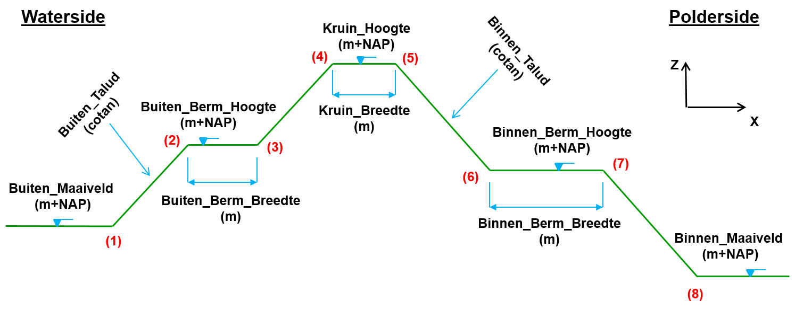
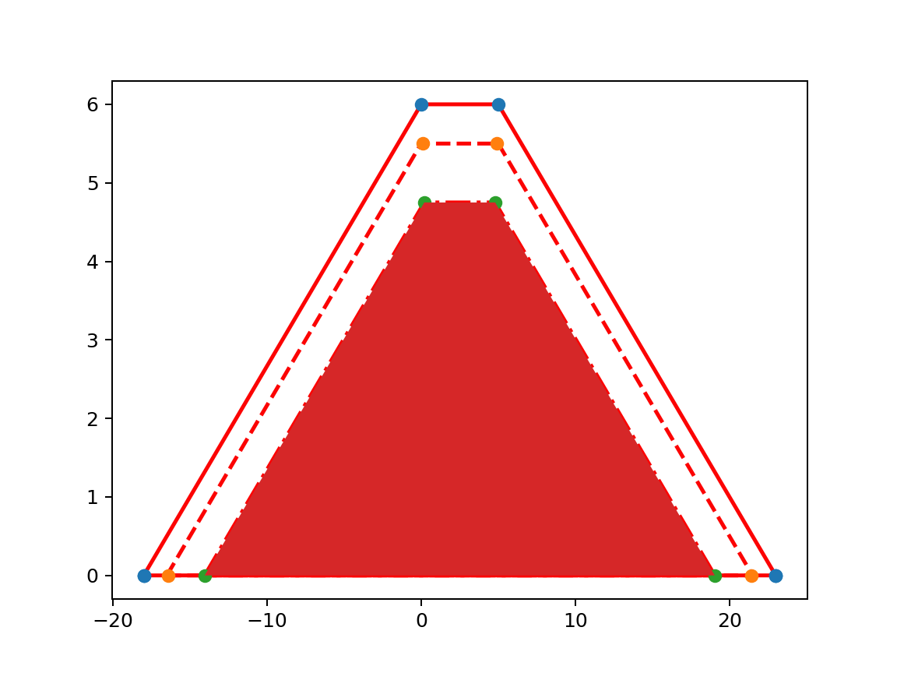
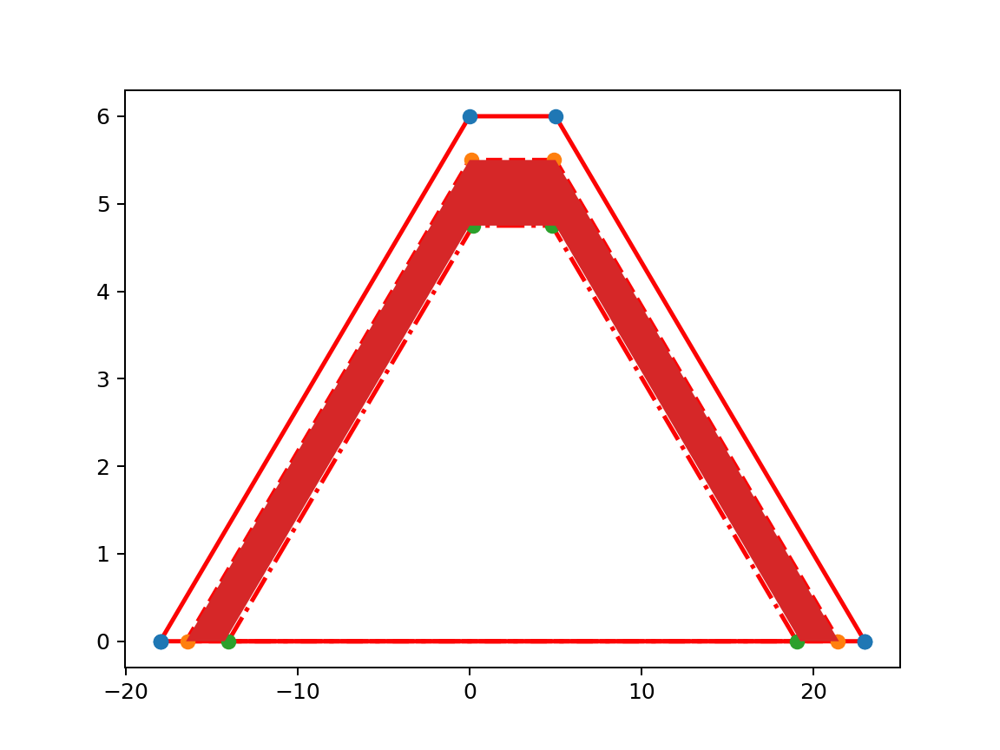
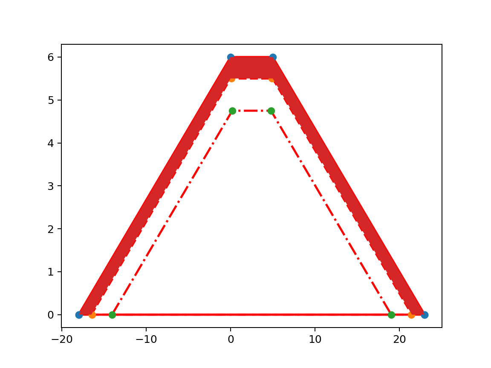

# Dike profile

In this section we will describe how a Koswat dike is defined and what its parts are.

## Koswat properties

A koswat dike is represented by an instance of a `KoswatProfileProtocol`. And its properties represent different aspects of a 'real domain'. With _Image 1. Base profile properties_ as reference, we can see the mapping between said 'real domain' and the koswat properties:

- `input_data`: The parts of a dike (written on the image reference), which are directly mapped as an implementation of the `KoswatInputProfileProtocol`. 
- `characteristic_points`: 8 points given by the user describing the dike on (x,y) coordinates, the first four represent the waterside, the last four the polderside. Numbered in the reference picture from 1 to 8. 
- `layers_wrapper`: The description on how the layers of the dike are built. Further described in [Dike layers](#dike-layers).
- `location`: coordinate (x, y) where the dike is situated.
- `profile_width`: The difference between the lowest and the highest 'x' coordinates of the profile characteristic points. The distance between characteristic point 1 and 8.

||
|:--:|
|Image 1. Base profile properties|

## Dike layers
A dike is composed by three layers:

- Sand, the core layer.
- Clay, a coating layer.
- Grass, a (top) coating layer.

These layers are wrapped under a `KoswatLayersWrapperProtocol`  instance. At the same time, each layer is an instance of a `KoswatLayerProtocol` containing the following properties:

- `material_type`: Either Sand, Clay or Grass.
- `upper_points`: The surface points of the layer. This property can be used to calculate the _surface_ (m2) of a material.
- `outer_geometry`: A polygon representing the material layer and the 'wrapped' polygons. For instance, the Clay `outer_geometry` will also include the Sand `material_geometry`.
- `material_geometry`: A closed polygon containing __only__ the points representing the layer.

Using _Image 3. Clay layer highlighted_ as an example, we can map the previous properties:

- `material_type`: Clay, the 'in-between' layer.
- `upper_points`: Line with the 'orange' points, without 'closing' the polygon, something like: [(-18, 0), (0, 5.5), (8, 5.5), (21, 0)].
- `outer_geometry`: Closed geometry using the `upper points` and the 'ground floor' points: [(-18, 0), (0, 5.5), (8, 5.5), (21, 0), __(-18, 0)__].
- `material_geometry`: Closed geometry using the `upper_points` from Clay and the `upper_points` from the layer below (Sand, green points). Should be something like: [(-18, 0), (0, 5.5), (8, 5.5), (21, 0), __(19, 0), (8, 4.75), (0, 4.75), (-14, 0), (-18, 0)__]

||
|:--:|
|Image 2. Sand layer highlighted|

||
|:--:|
|Image 3. Clay layer highlighted|

||
|:--:|
|Image 4. Grass layer highlighted|
