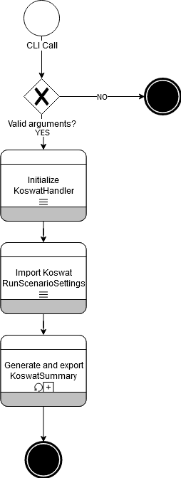

# Main workflow

As described in the [user manual](../user_manual.md), the tool can be used either as a sandbox, where the user has responsibility on how to put together an analysis, or as a command line tool. 

When using the latter unfortunately we will only have one available call, in this chapter we will breakdown this main workflow so that we can better understand the structure of the rest of the package.

First of all, let's write the workflow as a pipeline:

```
CLI call 
-> Import of ini files 
-> Run scenarios 
    -> Generate reinforcement profiles 
    -> Calculate reinforcement costs 
        -> Apply measure selection strategy 
        -> Calculate total costs
    -> Export results
```

||
|:--:|
|Image 1. General Workflow|

## CLI Call

This step is very straightforward, the command line will run the method `run_analysis`, which will initiate the `KoswatHandler` and start an analysis.

## Import of ini files
This step comprehends of several more steps. Usually, for each of the file imports an internal workflow will happen:

`File -> Import -> File Object Model -> Build -> Data Object Model`

This step is summarized by the generation of the `KoswatRunSettings` object.

## Run scenarios
Each `KoswatRunScenarioSettings` will run a koswat analysis for a given dike section.
To do so, a specific `KoswatProfileBase` will be created based on the conditions from the `KoswatScenario` and the surroundings of said dike section.

## Generate reinforcement profiles
All reinforcement profiles will be calculated for the scenario `KoswatProfileBase` profile. 

## Calculate reinforcement costs
For this step, we will be creating a [cost report](koswat_cost_report.md)
For each of the reinforcement profiles we will calculate their associated costs if they were to be applied at all the available traject points where the surroundings allow it.

## Apply measure selection strategy
Based on the available locations and the reinforcements that can be applied to it, a [selection strategy](koswat_strategies.md) finds which construction should be done at each location based on the strategy's criteria.

## Calculate total costs
Once `Koswat` knows which measure will be applied to each location, and with the previously calculated [reinforcement costs](#calculate-reinforcement-costs), it will estimate the total meters required of each reinforcement and their total cost in euros (€).

## Export results
Once the costs reports are generate each of the summaries is exported to a `*.csv` file whilst the reinforcement profiles 'layers' are also exported into different `*.png` files.

