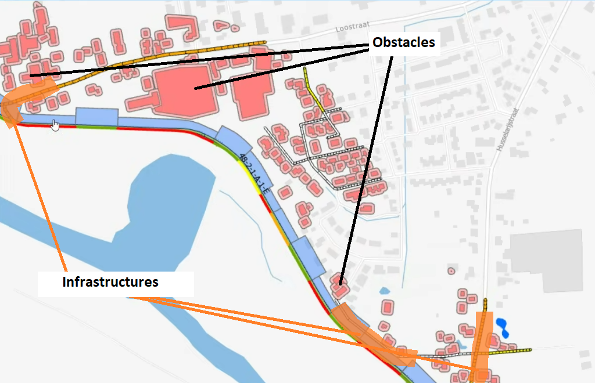
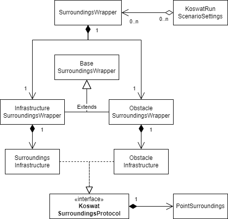

# Surroundings

In koswat's real domain, a dike is surrounded by all sort of surroundings, these could be nature or human-built structures. During our analyisis we make use of (`.shp`) maps where a dike's traject is shown together with all the human-built structures in its proximity. 

We categorize these structures in the following two types:

- [Obstacles](#obstacles), surroundings that __cannot__ be modified in any way.
- [Infrastructures](#infrastructures), as opposite to the obstacles, surroundings that can be repaired or removed and added again (elsewhere).

||
|:--:|
|Image 1. Surroundings representation|

To define said surroundings we make use of `.csv` files, each file for a specific type of surrounding that needs to be "enabled" in the `koswat_general.ini` settings file.

In addition, surroundings can be defined for the inside or the outside of a dike. At the current `Koswat` version (unreleased `v0.15.0`) we __only support__ surroundings in the inside of a dike ( `binnendijks`).

## Surroundings `.csv` files

The surroundings files follow all the same format both in naming and content. 

Their file name has the form of `T{dike_traject}_{type_of_surrounding}.csv`:
- The `{dike_traject}` is the dike's traject code name, usually something like `10_1`,
- the `{type_of_surrounding}` is the name of surrounding that will be imported (check further in the corresponding subsections of [obstacles](#obstacle-types) and [infrastructure](#infrastructure-types)).

Their headers are divided in the following columns:

- `SECTIE`, section of the location in the dike's traject,
- `Xcoord`, x coordinate of the location,
- `Ycoord`, y coordinate of the location, 
- `afst_{x}m`, distance from the reference point of the location, where 'x' are all the values between `5` and `200` with steps of 5, thus 40 columns. The values in these cells define whether there are obstacles or infrastructures at this distance or not and in `Koswat` are usually built in the `SurroundingsPoint.surroundings_matrix`, each type of surrounding interprets the weights in a different manner.

## Obstacles

An obstacle usually represents a building, because they cannot be removed they become a constraint to the possible reinforcements that can be applied at a given location. For instance, if a dike's reinforcement will become 5 meters wider, but within that distance there are obstacles, said reinforcement will be discarded as a possible option at that location.
The distance from the reference point of the dike to the closes point of the obstacle is given.

The values in the columns `afst_{x}m` are either `1` or `0` and are simply interpreted as having a surrounding or not. Thus ignoring other characteristics of the surrounding and just focusing on its presence.

### Obstacle types

Currently we identify and support the following surroundings as written in the `.csv` file names:

- `bebouwing_binnendijks` (buildings), 
- `spoorwegen_binnendijks` (railways),
- `waters_binnendijks` (waters),

As reminder, at the moment we only support 'inside the dike's' surroundings.

## Infrastructures

Infrastructures are mostly "roads". Contrary to the [obstacles](#obstacles) these infrastructures do not become a boundary for a reinforcement and they will simply be either displaced or repaired when applying a reinforcement requires their space. When this occurs, it is reflected as additional costs for the given type of reinforcement at that location. In short, these costs are calculated based on:

- The width of the infrastructure (taken from the `Koswat_general.ini` settings),
- The length of the infrastructure at that location (the values in the columns `afst_{x}m`),
- The required technique (repair, displace, nothing) for the type of infrastructure (also from `koswat_general.ini` settings) and its related costs (`koswat_costs.ini`).

With the above values we know what's the __affected area__ of an infrastructure when a reinforced profile needs to be applied and therefore can estimate their costs.

The distance from the reference point of the dike to the center point of the infrastructure is given.

### Infrastructures types

Currently we identify and support the following surroundings as written in the `.csv` file names:

- `wegen_binnendijks_klasse2` (roads class 2),
- `wegen_binnendijks_klasse7` (roads class 7),
- `wegen_binnendijks_klasse24` (roads class 24),
- `wegen_binnendijks_klasse47` (roads class 47),
- `wegen_binnendijks_klasseonbekend` (roads of unknown class),

As reminder, at the moment we only support 'inside the dike's' surroundings.

## Surroundings in the code

But, how are these surroundings represented in the code? As earlier described, we distinguish surroundings by either [obstacles](#obstacles) or [infrastructures](#infrastructures). This is also reflected in the code where we create a general [SurroundingsWrapper](./koswat_docstrings/dike/surroundings.md), which as the name states, wraps the obstacle and infrastructure surroundings in separate properties, each implementing an specialitzation of the `BaseSurroundingsWrapper` so that: 

- `ObstacleSurroundingsWrapper` will wrap all the supported [obstacle types](#obstacle-types), in separate properties of type `SurroundingsObstacle`.
- `InfrastructureSurroundingsWrapper` will wrap all the supported [infrastructure types](#infrastructures-types), in separate properties of type `SurroundingsInfrastructure`.

A simple diagram illustrating the above can be seen in the image below:

||
|:--:|
|Image 2. Surroundings code-wise|

More detailed information can be found in the corresponding [surroundings subproject](https://github.com/Deltares/Koswat/blob/86630ecc065aaa06890ac63a22b00f780fc98b3c/koswat/dike/surroundings).
